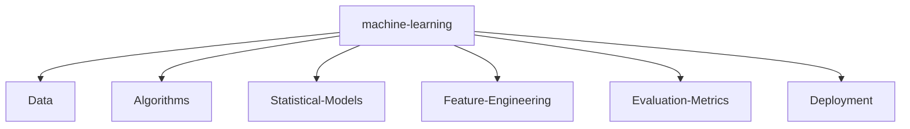

<!--   my-icons -->
<p align="center">
    <a href="https://github.com/AbdullahAssi/AbdullahAssi"></a>
    <a href="https://github.com/python/cpython"></a>
    <a href="https://github.com/AbdullahAssi/AbdullahAssi/graphs/contributors"></a>
    <a href="https://github.com/AbdullahAssi/AbdullahAssi/stargazers"></a>
    <a href="https://github.com/AbdullahAssi/AbdullahAssi/network/members"></a>
       
</p>

<!--   my-header-img -->


<a href="https://www.python.org/"></a>

<!--   my-ticker -->

[](https://git.io/typing-svg)

<!--   my-kaggle
### My achievements on [kaggle](https://www.kaggle.com/andrej0marinchenko):


-->

<!--   my-skils -->

| Property                                        | Data                                                                                                                                                                                                                                                                                                                                                                                                                                                                                                                                                                                                                                                                                                                                                                                                                                                                                                                                                                                                                                                                                                                                                                                                                                                                                                                                                                                                                                                                                                                                                                                                                                                                                                                                                                                                                                                                                                                                                                                                                                                                                                                                                                                                                                                                                                                                                                                                                                                                                                                                                                                                                                                                                                                                                                                                                                                                                                                                                                                                                                                                                                                   |
                                                                                                                                                                                                                                                                                                                                                                                                                                                                                                                                                                                                                                                                                                                                                                                                                                                                                                                                                                                                                                                                                                                                                                                                                                                                                                                                                                                                                                                                                                                                                                   |
                                                                                                                                                                                                                                                                                                                                                                                                                                                                                                                              
<!--   GitHub stats graph --

### 📈 GitHub Activity Graph:

<!-- [](https://github.com/AbdullahAssi/github-readme-activity-graph) -->


| . | . |
|-----------------------------------------------------------------------------------------------------------------------------------------|---------------------------------------------------------------------------------------------------------------------------|
|  |  |

</img>

<!--   profile-green-animate -->


<!--   grid-snake -->


<!--   skyline
<a href="https://skyline.github.com/AbdullahAssi/2022"></a>
-->

<!--  2d history skills -->

</img>


<div align="center">
<summary>Trophy: Github Profile Trophy</summary>
</div>

<p align="center"> 
<a href="https://github.com/ryo-ma/github-profile-trophy"></a>
</p>

   <!--machine-learning-->




<!-- Belarus - My Home-->

```geojson
{
  "type": "FeatureCollection",
  "features": [
    {
      "type": "Feature",
      "id": 1,
      "properties": {
        "ID": 0
      },
      "geometry": {
        "type": "Polygon",
        "coordinates": [
          [
            [
              23.5,
              53.9
            ],
            [
              32.6,
              52.6
            ]
          ]
        ]
      }
    }
  ]
}
```


#### Thanks for visiting :heart:

<p align="center"> 


counting of visitors to this page in this section started from May 8, 2022
<a href="http://s01.flagcounter.com/more/ap7"></a>

## Star History

[](https://star-history.com/#AbdullahAssi/AbdullahAssi&Date)


[MIT](LICENSE)

